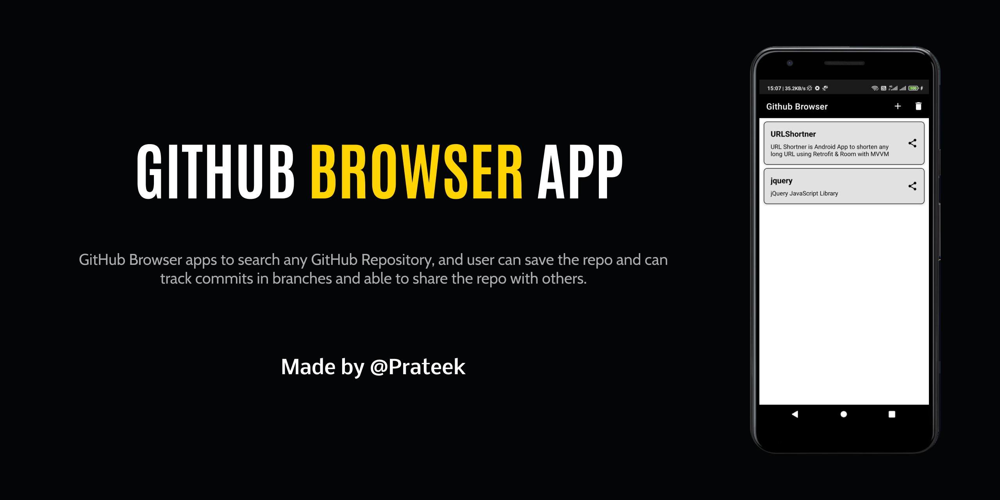
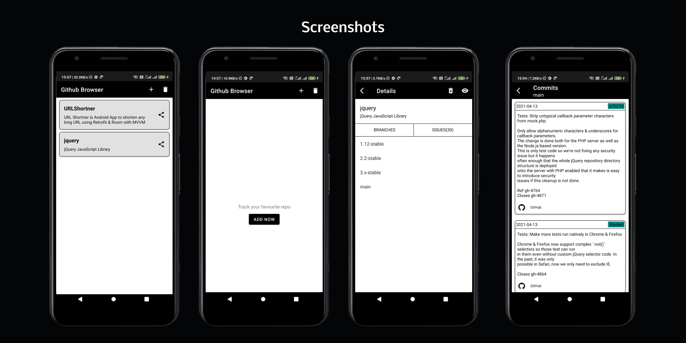

# GithubBrowser
GitHub Browser apps to search any GitHub Repository, and user can save the repo and can track commits in branches and able to share the repo with others. Made by [Prateek](https://github.com/prateekcode/)

***Download the latest apk from below 👇***

## Built With 🛠
* [Kotlin](https://kotlinlang.org/) - Official programming language for Android Development
* [Coroutines](https://kotlinlang.org/docs/reference/coroutines-overview.html) - For asynchronous
* [Android Architecture Components](https://developer.android.com/topic/libraries/architecture) - Collection of libraries that help you design robust, testable, and maintainable apps.
* [Jetpack DataStore](https://developer.android.com/topic/libraries/architecture/datastore) - etpack DataStore is a data storage solution that allows you to store key-value pairs or typed objects with protocol buffers. DataStore uses Kotlin coroutines and Flow to store data asynchronously, consistently, and transactionally
  * [LiveData](https://developer.android.com/topic/libraries/architecture/livedata) - Data objects that notify views when the underlying database changes.
  * [ViewModel](https://developer.android.com/topic/libraries/architecture/viewmodel) - Stores UI-related data that isn't destroyed on UI changes.
  * [Room](https://developer.android.com/topic/libraries/architecture/room) - SQLite object mapping library.
* [Retrofit](https://square.github.io/retrofit/) - Retrofit is the class through which your API interfaces are turned into callable objects.
* [Coil](https://github.com/coil-kt/coil) - Image Loading library
* [Circle Image View](https://github.com/hdodenhof/CircleImageView) - A fast circular ImageView perfect for profile images.
* [Material Components](https://material.io/develop/android) - To build beautiful, usable products using Material Components for Android

## Screenshots 📸

## Contribute 🤝
If you want to contribute to this project, you're welcome.
  * Open issue regarding proposed changed
  * Fork this repo and do changes
  * Open PR to new branch
  * You're done!
